# ⚡ FiL_Design_ImageMind

> **AI-powered ComfyUI node pack** — LLM vision analysis, prompt engineering, tiled upscaling, sampling and colour work in one coherent, themed UI.

[](https://www.python.org/)
[](https://github.com/comfyanonymous/ComfyUI)
[](https://docs.comfy.org/custom-nodes/backend/lifecycle)
[](#node-reference)
[](LICENSE)

[English](#english) · [Русский](#русский)

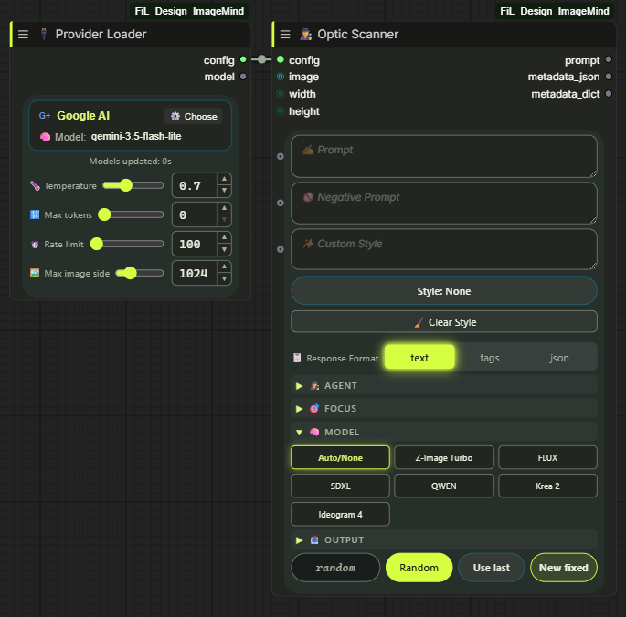

---

## English

- [What is this](#what-is-this)
- [Requirements](#requirements)
- [Installation](#installation)
- [Provider setup](#provider-setup)
- [Quick start](#quick-start)
- [Node reference](#node-reference)
- [Tiled upscale pipeline](#tiled-upscale-pipeline)
- [Prompting system](#prompting-system)
- [Settings](#settings)
- [Themes, shortcuts, localization](#themes-shortcuts-localization)
- [HTTP API](#http-api)
- [Screenshots](#screenshots)
- [Troubleshooting](#troubleshooting)
- [Development](#development)
- [Project layout](#project-layout)
- [Privacy & security](#privacy--security)

### What is this

A custom node pack for **ComfyUI**, written against the **V3 node API** (`io.ComfyNode`,
declarative `define_schema()`, async `execute()`), with a Vue 3 + TypeScript frontend bundled
into `frontend/dist`. It covers four areas:

| Area | What you get |
|---|---|
| 🧠 **LLM & vision** | Seven providers (local and cloud), 21 analysis agents, model-specific prompt profiles for Z-Image, FLUX, SDXL, QWEN, Krea 2 and Ideogram 4 |
| 🖼️ **Image pipeline** | Tile-grid planning with real overlap maths, model upscaling, per-tile crops in pixel *and* latent space, feathered re-assembly, automatic colour correction |
| 🎛️ **Sampling** | A full KSampler with every sampler/scheduler, passthrough sockets, built-in preview, plus HighRes-fix and Noise-Control scripts |
| 🎨 **UI** | Every node draws a real Vue panel — six themes, full ru/en localization, compact toggles, numeric steppers, contract-driven option lists |

**Design rules the pack follows:** node files stay thin (schema + orchestration) while the logic
lives in `common/`; the widget contract in `common/contracts/` is the single source of truth and is
generated into the frontend, so a panel can never offer a value the backend rejects; every node in
this release went through a hardening checklist (audit → UX → functional fixes → UI → tests →
contract → live smoke on a running ComfyUI), recorded in
[`docs/release/HARDENING_LEDGER.md`](docs/release/HARDENING_LEDGER.md).

### Requirements

| | |
|---|---|
| ComfyUI | **0.3.60+** (V3 node API) |
| Python | **3.10 / 3.11 / 3.12** |
| Python deps | `requests>=2.31`, `aiohttp>=3.9`, `PyYAML>=6.0.1`, `Pillow>=10`, `numpy>=1.26` |
| GPU | Not required by the pack itself — the sampling/upscale nodes use whatever ComfyUI already uses |
| LLM | Optional. Local (Ollama / LM Studio) works with no key and no account |

The frontend is shipped pre-built (`frontend/dist` is committed), so Node.js is **not** needed to
run the pack — only to develop it.

### Installation

**ComfyUI Manager** — search for `FiL_Design_ImageMind` and install.

**Manual:**

```bash
cd ComfyUI/custom_nodes
git clone https://github.com/FiL-Design-Ai/FiL_Design_ImageMind.git
pip install -r FiL_Design_ImageMind/requirements.txt
```

On a portable/embedded ComfyUI install, use its interpreter for the requirements:

```bash
python_embeded\python.exe -m pip install -r ComfyUI\custom_nodes\FiL_Design_ImageMind\requirements.txt
```

On Windows, `install_requirements.bat` in the pack folder does that step for you:
it finds ComfyUI's own Python (`python_embeded`, `venv` or `.venv`), installs the
requirements into it and verifies the imports.

Restart ComfyUI. The nodes appear under **🎨 FiL Design/** in the node browser
(`LLM`, `Analysis`, `Styling`, `Sampling`, `Image`, `Values`, `Tools`).

### Provider setup

Seven providers ship in `common/config.py`. Local ones need nothing but a running server; cloud ones
need a key.

| Provider | Type | Endpoint | Key |
|---|---|---|---|
| 🦙 **Ollama** | Local | `http://127.0.0.1:11434` | none |
| 🤖 **LM Studio** | Local | `http://127.0.0.1:1234` | none |
| 🧠 **OpenAI** | Cloud | `api.openai.com/v1` | `OPENAI_API_KEY` |
| 🔵 **Google AI (Gemini)** | Cloud | `generativelanguage.googleapis.com` | `GOOGLE_API_KEY` |
| ⚡ **Groq** | Cloud | `api.groq.com/openai/v1` | `GROQ_API_KEY` |
| 🌐 **OpenRouter** | Cloud | `openrouter.ai/api/v1` | `OPENROUTER_API_KEY` |
| ☁️ **Cloudflare Workers AI** | Cloud | per-account endpoint | `CLOUDFLARE_API_TOKEN` + `CLOUDFLARE_ACCOUNT_ID` |

**Where keys are read from, in order:**

1. `data/auth.json` — written by **Settings → FiL_Design_ImageMind → Providers** (git-ignored).
2. A real OS environment variable.
3. `API.env` in the pack root — `KEY=value` lines, git-ignored.

`config.yaml` holds non-secret defaults (timeouts, rate limits, local server URLs). `OLLAMA_URL`
and `LMSTUDIO_URL` can be overridden from the environment.

**Verify a provider** without running a graph: the Provider Loader panel shows a live status badge
(the pack probes configured providers in the background and surfaces the error text when one fails),
and `GET /fil_design_imagemind/models/<provider>` lists the models it can actually see.

OpenRouter has a built-in **free-model vision fallback**: if the selected model can't do vision or
is rate-limited, the request is retried down a curated chain of free vision models
(`common/config.py`, `common/provider_resilience.py`).

### Quick start

Two ready workflows ship in [`docs/workflows/`](docs/workflows) — drag the `.json` onto the canvas:

| Workflow | What it does |
|---|---|
| `fil-image-to-prompt.json` | Load image → Provider Loader → Optic Scanner → prompt out |
| `fil-text-prompt-studio.json` | Text idea → prompt expansion with styles and model profile |

Building it by hand takes three nodes:

1. **🔌 Provider Loader** — pick provider + model (hit *refresh* to pull the live model list).
2. **🕵️ Optic Scanner** — wire `config` in, connect an `image` (or type into `prompt`), choose an
   agent and a `model_type`, and wire your target `width`/`height` in (they are sockets, not fields).
3. Wire `prompt` into your CLIP Text Encode and queue.

### Node reference

All 15 nodes, grouped by category. Ranges below are the real schema limits.

#### 🎨 FiL Design/LLM

<details>
<summary><b>🔌 Provider Loader</b> — <code>FiLProviderLoader</code> — selects provider, model and generation parameters</summary>

Outputs a `config` object that every LLM-aware node in the pack consumes, plus the resolved model
name as a string.

| Input | Type | Default | Range / options |
|---|---|---|---|
| `provider` | COMBO | `ollama` | ollama, lmstudio, openai, google, groq, openrouter, cloudflare |
| `model` | COMBO | live list | fetched from the provider |
| `refresh_models` | BOOLEAN | `false` | re-fetches the model list |
| `temperature` | FLOAT | `0.7` | 0.0 – 2.0, step 0.05 |
| `max_tokens` | INT | `0` | 0 – 65536 (0 = provider default) |
| `rate_limit_ms` | INT | `100` | 0 – 5000 — minimum gap between requests |
| `max_image_side` | INT | `1024` | 128 – 4096, step 64 — images are downscaled before upload |

**Outputs:** `config` (FilProviderConfig), `model` (STRING)

</details>

<details>
<summary><b>🕵️ Optic Scanner</b> — <code>FiLOpticScanner</code> — vision analysis and prompt generation</summary>

The centrepiece: analyses an image (or expands a text idea) and writes a prompt tuned for the
target diffusion model. Prompt fields are resizable and also work as input sockets.

| Input | Type | Default | Range / options |
|---|---|---|---|
| `config` | FilProviderConfig | — | from Provider Loader |
| `agent` | COMBO | `⚪ None` | subject domain, 13 options — Portrait, Products, Nature & Landscape, Art & Illustration, Fashion, Animals, Architecture, Interior, City, Transport, Food, Games |
| `agent_focus` | COMBO | `⚪ None` | craft layer laid over the agent — 📐 Composition, 💡 Lighting & Color, 🔬 Ultra Detail, 🎬 Cinematic |
| `image` | IMAGE (optional) | — | leave empty for text-only mode |
| `width` / `height` | INT socket (optional) | `0` | connection-only — wire the target resolution in from Empty Latent Image or a resolution picker; > 0 tailors the prompt to that aspect ratio |
| `prompt` | STRING (optional) | `""` | your idea / seed text |
| `negative_prompt` | STRING (optional) | `""` | passed through to the metadata |
| `detail_level` | COMBO | `normal` | tiny, short, normal, detailed, ultra |
| `language` | COMBO | `en` | en, ru |
| `model_type` | COMBO | `Auto/None` | Z-Image Turbo, FLUX, SDXL, QWEN, Krea 2, Ideogram 4 |
| `prompt_mode` | COMBO | `Auto` | Auto, Hybrid, Two-Stage |
| `photo_style` / `art_style` | COMBO | `None` | 158 photo + 130 art presets, grouped by category |
| `nsfw_photo_style` / `nsfw_art_style` | COMBO | `None` | separate 18+ catalogs |
| `custom_style` | STRING (optional) | `""` | free-form style text, merged with the picks |
| `seed` | INT | `-1` | -1 – 999999999999 (-1 = random) |
| `response_format` | COMBO | `text` | text, tags (flat comma list), json (enables the Ideogram 4 / FLUX JSON schema) |

**Outputs:** `prompt` (STRING), `metadata_json` (STRING), `metadata_dict` (FilDict)

`metadata_dict` carries `sent_prompt` — the exact system/user text of the LLM call that produced
the result, which is what you want when debugging a bad generation.

</details>

#### 🎨 FiL Design/Analysis

<details>
<summary><b>👁️‍🗨️ Image Decomposer</b> — <code>FiLImageDecomposer</code> — splits an image or prompt into layers</summary>

| Input | Type | Default | Options |
|---|---|---|---|
| `config` | FilProviderConfig | — | from Provider Loader |
| `image` | IMAGE (optional) | — | visual decomposition |
| `prompt` | STRING (optional) | `""` | text decomposition |
| `language` | COMBO (optional) | `English` | en, ru |

**Outputs:** `subject`, `lighting`, `composition`, `style`, `full_prompt` (all STRING)

Wire the individual layers into separate conditioning branches when you want to vary one aspect
(lighting, say) while holding the rest fixed.

</details>

#### 🎨 FiL Design/Styling

<details>
<summary><b>🎛️ Style Mixer</b> — <code>FiLStyleMixer</code> — weighted blend of styles and reference images</summary>

| Input | Type | Default | Notes |
|---|---|---|---|
| `config` | FilProviderConfig (optional) | — | only needed for LLM fusion |
| `fusion_mode` | COMBO | `Weighted Stack (Fast)` | or `Smart LLM Fusion (Gen-Mix)` |
| `base_prompt` | STRING | `""` | the prompt the styles are applied to |
| `image_1..4` | IMAGE (optional) | — | reference images |
| `img_weight_1..4` | FLOAT (optional) | 0.8 / 0.6 / 0.4 / 0.2 | influence per reference |
| `img_focus_1..4` | COMBO (optional) | `Auto / General` | Style & Texture, Color & Lighting, Subject & Composition, Mood & Atmosphere |
| `style_1..3` | COMBO (optional) | `(None)` | from the same 288-preset catalog as the Scanner |
| `weight_1..3` | FLOAT (optional) | 1.0 / 0.5 / 0.3 | influence per style |

**Outputs:** `styled_prompt` (STRING), `style_overlay` (STRING)

`Weighted Stack` is deterministic string composition (no API call). `Smart LLM Fusion` sends the
stack to the vision model for a coherent rewrite and needs `config`.

</details>

#### 🎨 FiL Design/Sampling

<details>
<summary><b>⚡ KSampler</b> — <code>FiLKSampler</code> — full sampler with passthrough and scripts</summary>

| Input | Type | Default | Range / options |
|---|---|---|---|
| `model` | MODEL | — | |
| `seed` | INT | `0` | |
| `steps` | INT | `20` | |
| `cfg` | FLOAT | `7.0` | |
| `sampler_name` | COMBO | `euler` | every sampler ComfyUI exposes (loaded lazily at schema time) |
| `scheduler` | COMBO | `simple` | simple, sgm_uniform, karras, exponential, ddim_uniform, beta, … |
| `positive` / `negative` | CONDITIONING | — | |
| `latent_image` | LATENT | — | |
| `denoise` | FLOAT | `1.0` | |
| `eta` (η) | FLOAT | `1.0` | ancestral/SDE samplers only — see [`docs/ETA_GUIDE.md`](docs/ETA_GUIDE.md) |
| `bongmath` | BOOLEAN | `true` | |
| `preview_method` | COMBO | `auto` | auto, latent2rgb, taesd, vae_decoded_only, none |
| `vae_decode` | COMBO | `true` | true, true (tiled), false |
| `optional_vae` | VAE (optional) | — | connection-only |
| `script` | FilHiresScript (optional) | — | HighRes Fix and/or Noise Control |

**Outputs:** `model`, `positive`, `negative`, `latent`, `vae`, `image` — the five passthroughs let
you chain samplers without re-dragging every wire.

</details>

<details>
<summary><b>🔬 HighRes Fix</b> — <code>FiLHighResFix</code> — upscale + re-sample script for KSampler</summary>

Produces a `script` object; it does not sample on its own. Wire its output into the KSampler's
`script` input.

| Input | Type | Default | Range / options |
|---|---|---|---|
| `upscale_type` | COMBO | `latent` | latent, pixel, both |
| `hires_ckpt_name` | COMBO | `(use same)` | optionally re-sample with a different checkpoint |
| `latent_upscaler` | COMBO | `nearest-exact` | nearest-exact, bilinear, area, bicubic, bislerp |
| `pixel_upscaler` | COMBO | first model found | your `models/upscale_models` folder |
| `upscale_by` | FLOAT | `1.25` | |
| `use_same_seed` / `seed` | BOOLEAN / INT | `true` / `0` | |
| `hires_steps` | INT | `12` | |
| `denoise` | FLOAT | `0.56` | |
| `iterations` | INT | `1` | repeat the hires pass |
| `use_controlnet` | BOOLEAN | `false` | |
| `control_net_name` | COMBO | first found | tile ControlNets live here |
| `strength` | FLOAT | `1.0` | ControlNet strength |
| `preprocessor` | COMBO | `none` | none, canny |
| `script` | FilHiresScript (optional) | — | chain another script (e.g. Noise Control) |

**Output:** `script`

</details>

<details>
<summary><b>🎛️ Noise Control</b> — <code>FiLNoiseControl</code> — RNG source and seed variation script</summary>

| Input | Type | Default | Options |
|---|---|---|---|
| `rng_source` | COMBO | `cpu` | cpu, gpu |
| `add_seed_noise` | BOOLEAN | `false` | enables the variation blend |
| `seed` | INT | `0` | variation seed |
| `weight` | FLOAT | `0.5` | blend strength |
| `script` | FilHiresScript (optional) | — | chain with HighRes Fix |

**Output:** `script`

The variation blend uses a sin/cos rotation rather than a linear lerp, so noise keeps unit variance
at every `weight` — a linear blend would quietly weaken the effective denoise in the middle of the
range. Built on the public `comfy.sample` API; the legacy A1111 `cfg_denoiser` patching is
deliberately **not** ported.

</details>

#### 🎨 FiL Design/Image

<details>
<summary><b>🔍 Upscaler Advanced</b> — <code>FiLUpscaleTileCalc</code> — tile-grid planner + model upscaler</summary>

| Input | Type | Default | Range / options |
|---|---|---|---|
| `image` | IMAGE (optional) | — | omit for latent-only mode |
| `upscale_model` | UPSCALE_MODEL (optional) | — | connect one to actually upscale pixels |
| `latent` | LATENT (optional) | — | resized with bislerp and tiled 1:1 with the image grid |
| `upscale_factor` | FLOAT | `2.0` | 0.1 – 8.0, step 0.25 |
| `tile_size` | INT | `1024` | 64 – 2048, step 64 |
| `tile_overlap` | INT | `64` | 0 – 512, step 8 — clamped at half the tile |
| `auto_overlap` | BOOLEAN | `false` | derives overlap from tile size (~12.5%) |
| `auto_mode` | BOOLEAN | `false` | full auto — profile picks tile size and overlap |
| `auto_profile` | COMBO | `Balanced` | Low VRAM, Balanced, High VRAM, Max Quality, Ultra Quality |
| `manual_tile_cols` / `manual_tile_rows` | INT | `0` | 0 – 64 — pin an exact grid (0 = derive it) |
| `non_square_tiles` | BOOLEAN | `false` | rectangular tiles, aspect clamped at 1.5:1 |
| `auto_fix_thin_edges` | BOOLEAN | `false` | shrinks the tile to the next standard size to avoid a thin edge strip (no-op at 512 — the floor) |

**Outputs (21):** `image`, `tiles`, `upscale_by`, `denoise`, `tile_width`, `tile_height`,
`mask_blur`, `tile_padding`, `overlap`, `width`, `height`, `tile_cols`, `tile_rows`, `tile_count`,
`latent_w`, `latent_h`, `info`, `warnings`, `latent`, `latent_tiles`, `layout`

Notes worth knowing:

- Without `upscale_model` the `image` output is a passthrough — the node then only *plans* the grid.
- `tiles` are real cropped pixels. Edge tiles shift inward to stay full-size instead of being
  zero-padded, so no black strips.
- `overlap` is a FLOAT: with `non_square_tiles` the per-axis overlaps can differ and the reported
  average is legitimately fractional.
- `layout` carries the exact per-tile rectangles — that is what 🧩 Tile Assembly consumes.

</details>

<details>
<summary><b>🔍 Upscaler Simple</b> — <code>FiLUpscaleSimple</code> — same tiling panel, four outputs</summary>

Identical widget panel to Advanced and 100% delegation to it (one source of truth for the geometry),
trimmed to the outputs most graphs actually use.

**Outputs:** `image`, `tiles`, `latent`, `latent_tiles`, `layout`

</details>

<details>
<summary><b>🧩 Tile Assembly</b> — <code>FiLTileAssembly</code> — stitches processed tiles back together</summary>

| Input | Type | Notes |
|---|---|---|
| `tiles` | IMAGE | the processed tile batch, same order as it came out |
| `layout` | FilTileLayout | from either Upscaler |

**Output:** `image` — tiles are feathered across the real overlap zones, so seams don't show.

</details>

<details>
<summary><b>🎨 Color Wizard</b> — <code>FiLColorWizard</code> — automatic colour correction</summary>

| Input | Type | Default | Range / options |
|---|---|---|---|
| `image` | IMAGE | — | |
| `method` | COMBO | `Full Auto` | Full Auto, Gray World, White Patch, Channel Stretch, LAB Enhance |
| `strength` | FLOAT | `0.8` | 0.0 – 1.0 (0 = no change) |
| `saturate` | FLOAT | `0.5` | 0.0 – 5.0 — percentile saturation for Channel Stretch |
| `temperature` | FLOAT | `0.0` | -1.0 – 1.0 |
| `tint` | FLOAT | `0.0` | -1.0 – 1.0 |
| `preserve_skin` | BOOLEAN | `false` | protects skin tones from the correction |
| `reference` | IMAGE (optional) | — | match the palette of another image |
| `wb_mask` | MASK (optional) | — | white-balance picker: mask the area that should be neutral |

**Output:** `image`

</details>

#### 🎨 FiL Design/Dataset

<details>
<summary><b>📚 LoRA Dataset Forge</b> — <code>FiLDatasetForge</code> — batch → training-ready LoRA dataset on disk</summary>

One pass: aspect-ratio buckets at the target resolution, one LLM caption per frame, files written
where kohya_ss / sd-scripts can read them.

| Input | Type | Default | Notes |
|---|---|---|---|
| `image` | IMAGE | — | the whole batch; one file per frame |
| `config` | FilProviderConfig (optional) | — | from 🔌 Provider Loader; only needed for LLM captions |
| `captions` | STRING (optional) | — | manual captions split on a `---` line — takes Optic Scanner output as-is and skips the LLM |
| `dataset_name` | STRING | `my_lora` | folder under `ComfyUI/output/datasets`, sanitized |
| `trigger_word` | STRING | — | token that activates the LoRA, prepended to every caption |
| `class_token` | STRING | — | `woman`, `car`, … — follows the trigger in captions and in the kohya folder name |
| `base_resolution` | COMBO | `1024` | 512 – 1536; buckets are built around this area |
| `layout` | COMBO | `kohya` | `kohya` → `img/<repeats>_<trigger> <class>/` + `dataset.toml`; `flat` → images next to captions |
| `repeats` | INT | `10` | repeats per image per epoch |
| `caption_mode` | COMBO | `natural` | `natural` (Flux/SDXL) · `tags` (SD 1.5/Pony) · `hybrid` · `none` |
| `crop_mode` | COMBO | `center` | `entropy` crops toward the most detailed region instead |
| `dry_run` | BOOLEAN | `false` | plan the whole run, write nothing |
| `write_mode` | COMBO | `append` | `overwrite` deletes this node's image/caption pairs only — foreign files stay |
| `caption_max_words`, `caption_language`, `dont_caption`, `caption_instruction` | | | caption shaping |
| `bucket_step`, `caption_extension`, `image_format`, `jpg_quality`, `seed` | | | output details |

**Outputs:** `preview` (bucketed frames letterboxed onto one square canvas), `report`,
`dataset_path`, `manifest`.

Captioning follows the rule that decides whether a LoRA generalizes: **describe what varies**
(pose, clothing, background, lighting, camera angle, medium) and **never describe the invariant**
— that belongs to the trigger word. List the invariants in `dont_caption` and the prompt forbids
them explicitly.

The node never upscales. Sources smaller than their bucket are still written, counted in
`upscaled_count` and flagged in the report — run them through 🔍 Upscaler Simple first.

</details>

#### 🎨 FiL Design/Values · Tools

<details>
<summary><b>♻️ Seed</b> — <code>FiLSeed</code> · <b>🧹 Cleaner</b> — <code>FiLNeuroCleaner</code> · <b>🔀 Cyber Switch</b> — <code>FiLSignalSwitch</code></summary>

**♻️ Seed** — `seed` INT (0 – 2⁶⁴-1) → `SEED` INT. Panel is one row: the value plus 🔀 randomize,
♻️ reuse last, 🎲 new fixed random. Typing digits switches it to fixed and applies the value.

**🧹 Cleaner** — explicit toggles, no guesswork:

| Input | Type | Default |
|---|---|---|
| `clean_vram` | BOOLEAN | `true` |
| `unload_diffusion` | BOOLEAN | `true` |
| `unload_clip` | BOOLEAN | `false` |
| `unload_vae` | BOOLEAN | `false` |
| `unload_control` | BOOLEAN | `false` |
| `anything` | ANY (optional) | — passthrough, so you can insert it anywhere in a chain |

**Output:** `output` (ANY) — the same value that came in.

**🔀 Cyber Switch** — `input` (ANY, optional) + `enable` BOOLEAN → `output` (ANY). ON forwards the
value untouched. OFF returns ComfyUI's `ExecutionBlocker`, so every node downstream is **skipped**
and the rest of the graph still runs — a muted SaveImage simply writes nothing instead of raising.
The block is silent by design (a message would surface as an execution error, which muting is not).
An unconnected `input` blocks the same way, so an unwired switch can't feed `None` into a node that
expected a LATENT.

</details>

### Tiled upscale pipeline

The three image nodes are designed to chain:

```
LoadImage ─┬─► 🔍 Upscaler Advanced ─┬─ image  (upscaled, if a model is connected)
           │      ▲                  ├─ tiles  ──► your per-tile processing ──┐
UpscaleModelLoader                   ├─ latent / latent_tiles ──► per-tile KSampler
                                     └─ layout ─────────────────────────────┐ │
                                                                            ▼ ▼
                                                              🧩 Tile Assembly ──► image
```

What the planner actually does: aligns the target size to the tile grid, picks a tile size (fixed,
auto-profile, or derived from an explicit cols×rows), applies overlap per axis as a real grid step
(`step = tile − overlap`), clamps overlap at half a tile so the tile count can't explode, keeps
non-square tiles within a 1.5:1 aspect, and emits both the numeric plan (for Ultimate SD
Upscale-style downstream nodes) and the concrete crops.

Latent tiles use the same grid divided by 8 and are resized with **bislerp**, not lanczos — lanczos
is an RGB-specific interpolation and does not belong in latent space.

### Prompting system

- **Agents** (21 + None) set the analysis lens — Portrait pulls facial and lighting detail, Products pulls
  material and packaging detail, and so on. Tag output is `response_format = tags`, so it
  composes with any agent instead of replacing it.
- **Model profiles** rewrite the output for the target generator: Z-Image Turbo, FLUX, SDXL, QWEN,
  Krea 2, Ideogram 4. Rules live in `common/model_prompt_adapters.py`; the reasoning and sources are
  in [`docs/MODEL_PROMPTING_GUIDE.md`](docs/MODEL_PROMPTING_GUIDE.md), including an "Official guidance"
  subsection per model.
- **Ideogram 4 JSON schema** activates only when `response_format="json"` — see
  [`docs/MODEL_PROMPTING_GUIDE.md#7-ideogram-4---plain-text-optimization`](docs/MODEL_PROMPTING_GUIDE.md#7-ideogram-4---plain-text-optimization).
- **Prompt modes:** `Hybrid` is a single enriched call; `Two-Stage` analyses first, then writes the
  prompt from that analysis, falling back to stage 1 if stage 2 comes back too short; `Auto` picks
  between them.
- **Styles:** 158 photo + 130 art presets in `common/styles/`, browsable through a searchable picker
  with preview tiles. See [`docs/styles.md`](docs/styles.md).

### Settings

**Settings → FiL_Design_ImageMind:**

| Setting | Key | Default |
|---|---|---|
| Default LLM Provider | `FiL_Design_ImageMind.DefaultProvider` | `Ollama` |
| Request Timeout (seconds) | `FiL_Design_ImageMind.RequestTimeout` | `60` |
| Auto VRAM cleanup on completion | `FiL_Design_ImageMind.AutoCleanVRAM` | `false` |
| Language | `FiL_Design_ImageMind.Language` | `en` |
| Log level | `FiL_Design_ImageMind.Logging.Level` | `WARNING` |
| Node theme | `FiL_Design_ImageMind.Theme` | `Default` |
| Keyboard shortcuts | `FiL_Design_ImageMind.Shortcuts.Enabled` | `true` |
| Show connection toasts | `FiL_Design_ImageMind.ConnectionFX.ShowToasts` | `false` |
| Run button effects / duration | `FiL_Design_ImageMind.RunButton.*` | `true` / `Normal` |

The **Providers** tab in the same panel manages accounts and API keys (stored in `data/auth.json`).

### Themes, shortcuts, localization

**Themes** (applied live, no reload): `Default`, `Cyberpunk`, `Fallout`, `Pipboy`, `FiL Green`,
`Pixaroma` (matches the ComfyUI-Pixaroma pack's colors, for graphs that mix both).
All node panels read the same CSS variables, including `--fil-accent-ink` for text on accent
backgrounds, so a light-accent theme stays readable. Every palette is checked against WCAG AA
on its own surfaces — the measured ratios sit next to the values in `styles/brand.ts`.

**Shortcuts:** `Shift + ?` opens the cheat sheet, `/` focuses search. Toggle them off in Settings.

**Localization:** English and Russian, complete — panels, tooltips, toasts and node help all come
from `data/locales/{en,ru}.json`, and a test enforces key coverage.

### HTTP API

The pack registers these routes on the ComfyUI server (prefix from `common/brand.py`):

| Method | Route | Purpose |
|---|---|---|
| GET | `/fil_design_imagemind/health` | liveness + version |
| POST | `/fil_design_imagemind/log_level` | set the pack's log level at runtime |
| GET | `/fil_design_imagemind/providers` | provider catalog |
| GET | `/fil_design_imagemind/models/{provider}` | model list (`?force=1` bypasses the cache) |
| GET/POST | `/fil_design_imagemind/auth` | account/key management |
| POST | `/fil_design_imagemind/provider_probe` | test a provider/model round-trip |
| GET | `/fil_design_imagemind/locale/{lang}` | locale bundle |
| GET | `/fil_design_imagemind/node_contracts` | the widget contracts the frontend renders from |

### Screenshots

**LLM**

| Provider Loader | Optic Scanner | Image Decomposer |
|---|---|---|
| 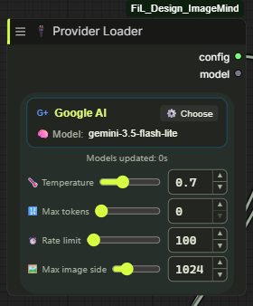 | 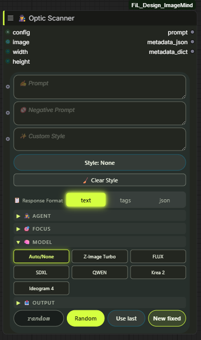 | 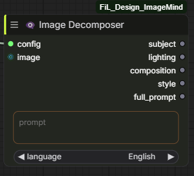 |

**Styling and analysis**

| Style Mixer | Color Wizard | LoRA Dataset Forge |
|---|---|---|
| 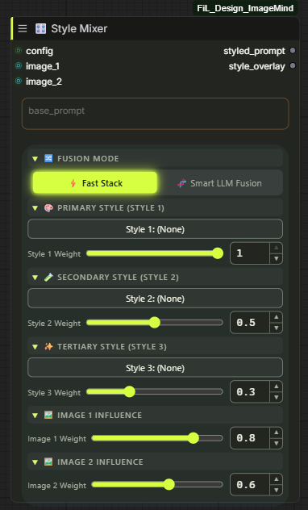 | 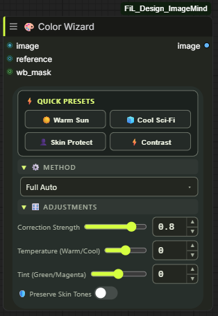 | 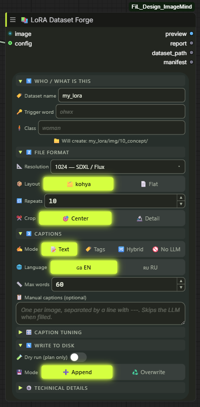 |

**Sampling** — Noise Control feeds HighRes Fix, which feeds the sampler's `script` socket.

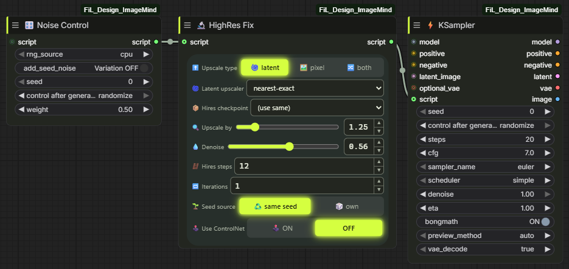

**Upscaling**

| Upscaler Advanced | Upscaler Simple | Tile Assembly |
|---|---|---|
| 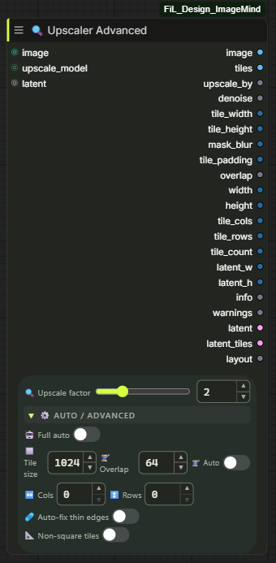 | 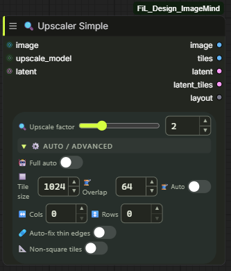 | 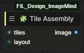 |

**Values and tools**

| Seed | Cyber Switch | Cleaner |
|---|---|---|
| 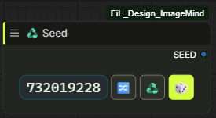 | 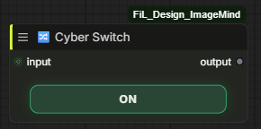 | 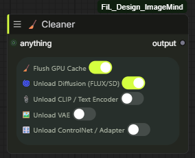 |

**Provider settings** — keys are stored in `data/auth.json` and shown redacted.

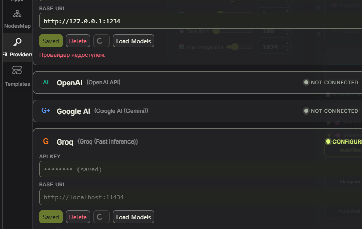

### Troubleshooting

| Symptom | Fix |
|---|---|
| **Nodes don't appear** | Check the ComfyUI console for an import error; confirm ComfyUI ≥ 0.3.60; confirm the folder is `custom_nodes/FiL_Design_ImageMind` |
| **Model list is empty** | Is the local server running (`ollama serve` / LM Studio)? For cloud, re-enter the key in Settings → Providers and press *refresh* |
| **Auth error** | The key is read from `data/auth.json` → OS env → `API.env`; a stale value in an earlier source wins — clear it |
| **Vision request fails on OpenRouter** | The selected model probably isn't vision-capable; the pack retries down a free-vision chain, but picking a vision model directly is faster |
| **Panels look unstyled / old** | Hard-reload the browser (`Ctrl+Shift+R`) — the bundle is cached by the browser |
| **Backend change didn't take effect** | Python edits need a full ComfyUI restart; rebuilding the frontend is not enough |
| **Tile count looks wrong** | Overlap grows the count by design (`step = tile − overlap`); an explicit cols×rows grid keeps the count and grows the tile instead |
| **Set a node's log level** | Settings → Log level, or `POST /fil_design_imagemind/log_level` |

### Development

```bash
# Python tests (use the interpreter that has torch — e.g. ComfyUI's embedded one)
python -m pytest -q

# Frontend
cd frontend
npm ci
npm run build          # vue-tsc type check + vite build into frontend/dist
npm run test           # vitest
npm run lint           # eslint
npm run gen:contracts  # regenerate contracts.ts/json from common/contracts/

# Static release checks
python tools/preflight_check.py       # node files, ids, entrypoint, bundle, syntax
python tools/scan_node_conflicts.py   # node-id collisions with other installed packs
```

Two things that bite if you skip them:

- `npm run gen:contracts` must run with an interpreter that can import ComfyUI, otherwise
  sampler/scheduler lists collapse to a one-item fallback and the generated contract regresses.
  Pass it explicitly: `PYTHON=/path/to/python npm run gen:contracts`.
- `frontend/dist` is committed on purpose — that is how the UI ships through the Registry and
  through `git clone`. Rebuild it in the same commit as any frontend change.

**Release gate:** `common/release_gate.py` registers only node-ids listed in `RELEASE_NODES`, so a
new node stays out of the ComfyUI menu until it has been through the hardening checklist. Set
`FIL_RELEASE_ALL=1` to register everything (CI and whole-package smoke tests do this).

### Project layout

```
FiL_Design_ImageMind/
├── __init__.py            # ComfyExtension entrypoint (V3), node registration
├── nodes/                 # thin node classes: schema + orchestration only
├── common/                # the actual logic
│   ├── contracts/         # widget contracts — single source of truth for the UI
│   ├── styles/            # photo + art style catalogs
│   ├── tile_calc.py       # tile geometry, crops, latent tiling
│   ├── sampling.py        # sampler loop, hires-fix, noise control
│   ├── color_correction.py
│   └── config.py          # providers, keys, YAML/env config
├── frontend/
│   ├── src/               # Vue 3 + TS: components, nodes2/, stores/, api/
│   └── dist/              # built bundle (committed)
├── data/locales/          # en.json, ru.json
├── docs/                  # guides, architecture, workflows, release ledger
├── tests/                 # pytest suite
└── tools/                 # preflight and conflict-scan scripts
```

Further reading: [architecture](docs/architecture.md) ·
[scanner internals](docs/architecture.md#optic-scanner-architecture) · [getting started](docs/getting-started.md) ·
[auth](docs/auth.md) · [prompting](docs/prompting.md) · [styles](docs/styles.md) ·
[eta guide](docs/ETA_GUIDE.md) · [changelog](CHANGELOG.md)

### Privacy & security

- API keys live in `data/auth.json` or `API.env`, both git-ignored; they are never written to
  workflow files or logs.
- Images are sent only to the provider you selected, and only when a node that needs vision runs.
  Local providers (Ollama, LM Studio) keep everything on your machine.
- Images are downscaled to `max_image_side` before upload — smaller payloads, lower cost.
- HTTP routes validate their inputs; the request timeout and per-provider rate limit are
  configurable rather than hardcoded.

---

## Русский

- [Что это](#что-это)
- [Требования](#требования)
- [Установка](#установка)
- [Настройка провайдеров](#настройка-провайдеров)
- [Быстрый старт](#быстрый-старт)
- [Справочник по узлам](#справочник-по-узлам)
- [Конвейер тайлового апскейла](#конвейер-тайлового-апскейла)
- [Система промптинга](#система-промптинга)
- [Настройки](#настройки)
- [Темы, горячие клавиши, локализация](#темы-горячие-клавиши-локализация)
- [HTTP API](#http-api-1)
- [Скриншоты](#скриншоты)
- [Решение проблем](#решение-проблем)
- [Разработка](#разработка)
- [Структура проекта](#структура-проекта)
- [Приватность и безопасность](#приватность-и-безопасность)

### Что это

Набор кастомных узлов для **ComfyUI** на **V3 API** (`io.ComfyNode`, декларативный
`define_schema()`, асинхронный `execute()`) с фронтендом на Vue 3 + TypeScript, собранным в
`frontend/dist`. Четыре направления:

| Направление | Что даёт |
|---|---|
| 🧠 **LLM и зрение** | Семь провайдеров (локальные и облачные), 21 агент анализа, профили промптов под Z-Image, FLUX, SDXL, QWEN, Krea 2 и Ideogram 4 |
| 🖼️ **Работа с изображением** | Планирование сетки тайлов с честной математикой нахлёста, апскейл моделью, реальные кропы тайлов в пиксельном *и* латентном пространстве, сборка с растушёвкой, авто-цветокоррекция |
| 🎛️ **Сэмплинг** | Полноценный KSampler со всеми сэмплерами/планировщиками, passthrough-сокетами и встроенным превью, плюс скрипты HighRes Fix и Noise Control |
| 🎨 **Интерфейс** | У каждого узла настоящая Vue-панель — шесть тем, полная ru/en локализация, компактные тумблеры, степперы у числовых полей, списки опций из контракта |

**Правила, которым следует пакет:** файлы нод тонкие (схема + оркестрация), логика живёт в
`common/`; контракт виджетов в `common/contracts/` — единственный источник истины, из него
генерируется фронтенд, поэтому панель физически не может предложить значение, которое отвергнет
бэкенд; каждая нода в этом релизе прошла чек-лист харденинга (аудит → UX → фиксы функционала → UI →
тесты → контракт → живой смоук на работающем ComfyUI), см.
[`docs/release/HARDENING_LEDGER.md`](docs/release/HARDENING_LEDGER.md).

### Требования

| | |
|---|---|
| ComfyUI | **0.3.60+** (V3 node API) |
| Python | **3.10 / 3.11 / 3.12** |
| Зависимости | `requests>=2.31`, `aiohttp>=3.9`, `PyYAML>=6.0.1`, `Pillow>=10`, `numpy>=1.26` |
| GPU | Самому пакету не нужен — узлы сэмплинга/апскейла используют то же, что и ComfyUI |
| LLM | Опционально. Локальные (Ollama / LM Studio) работают без ключа и аккаунта |

Фронтенд поставляется собранным (`frontend/dist` в репозитории), поэтому Node.js нужен **только**
для разработки, не для работы.

### Установка

**ComfyUI Manager** — найдите `FiL_Design_ImageMind` и установите.

**Вручную:**

```bash
cd ComfyUI/custom_nodes
git clone https://github.com/FiL-Design-Ai/FiL_Design_ImageMind.git
pip install -r FiL_Design_ImageMind/requirements.txt
```

Для портативной сборки ставьте зависимости её интерпретатором:

```bash
python_embeded\python.exe -m pip install -r ComfyUI\custom_nodes\FiL_Design_ImageMind\requirements.txt
```

В Windows этот шаг делает `install_requirements.bat` из папки пака: он сам находит
Python самого ComfyUI (`python_embeded`, `venv` или `.venv`), ставит туда зависимости
и проверяет импорты.

Перезапустите ComfyUI. Узлы появятся в разделе **🎨 FiL Design/** (`LLM`, `Analysis`, `Styling`,
`Sampling`, `Image`, `Values`, `Tools`).

### Настройка провайдеров

Семь провайдеров описаны в `common/config.py`. Локальным нужен только запущенный сервер, облачным —
ключ.

| Провайдер | Тип | Адрес | Ключ |
|---|---|---|---|
| 🦙 **Ollama** | Локальный | `http://127.0.0.1:11434` | не нужен |
| 🤖 **LM Studio** | Локальный | `http://127.0.0.1:1234` | не нужен |
| 🧠 **OpenAI** | Облако | `api.openai.com/v1` | `OPENAI_API_KEY` |
| 🔵 **Google AI (Gemini)** | Облако | `generativelanguage.googleapis.com` | `GOOGLE_API_KEY` |
| ⚡ **Groq** | Облако | `api.groq.com/openai/v1` | `GROQ_API_KEY` |
| 🌐 **OpenRouter** | Облако | `openrouter.ai/api/v1` | `OPENROUTER_API_KEY` |
| ☁️ **Cloudflare Workers AI** | Облако | эндпоинт аккаунта | `CLOUDFLARE_API_TOKEN` + `CLOUDFLARE_ACCOUNT_ID` |

**Откуда читается ключ, по порядку:**

1. `data/auth.json` — пишется из **Settings → FiL_Design_ImageMind → Providers** (в `.gitignore`).
2. Реальная переменная окружения ОС.
3. `API.env` в корне пакета — строки `KEY=value`, в `.gitignore`.

`config.yaml` хранит несекретные умолчания (таймауты, лимиты частоты, адреса локальных серверов).
`OLLAMA_URL` и `LMSTUDIO_URL` можно переопределить через окружение.

**Проверить провайдера** без запуска графа: панель Provider Loader показывает живой статус (пакет
фоново пробит настроенных провайдеров и выводит текст ошибки, если проверка не прошла), а
`GET /fil_design_imagemind/models/<provider>` показывает модели, которые он реально видит.

У OpenRouter встроен **фолбэк на бесплатные vision-модели**: если выбранная модель не умеет зрение
или упёрлась в лимит, запрос повторяется по подобранной цепочке бесплатных моделей
(`common/config.py`, `common/provider_resilience.py`).

### Быстрый старт

В [`docs/workflows/`](docs/workflows) лежат два готовых воркфлоу — перетащите `.json` на холст:

| Воркфлоу | Что делает |
|---|---|
| `fil-image-to-prompt.json` | Загрузка картинки → Provider Loader → Optic Scanner → промпт |
| `fil-text-prompt-studio.json` | Текстовая идея → расширение промпта со стилями и профилем модели |

Руками собирается из трёх узлов:

1. **🔌 Provider Loader** — выбрать провайдера и модель (кнопка *refresh* тянет живой список).
2. **🕵️ Optic Scanner** — подключить `config`, подать `image` (или писать в `prompt`), выбрать
   агента и `model_type`, подать целевые `width`/`height` (это сокеты, а не поля панели).
3. Вывод `prompt` — в CLIP Text Encode, и в очередь.

### Справочник по узлам

Все 15 узлов по категориям. Диапазоны ниже — реальные пределы схемы.

#### 🎨 FiL Design/LLM

<details>
<summary><b>🔌 Provider Loader</b> — <code>FiLProviderLoader</code> — провайдер, модель и параметры генерации</summary>

Отдаёт объект `config`, который потребляют все LLM-узлы пакета, плюс имя выбранной модели строкой.

| Вход | Тип | По умолчанию | Диапазон / опции |
|---|---|---|---|
| `provider` | COMBO | `ollama` | ollama, lmstudio, openai, google, groq, openrouter, cloudflare |
| `model` | COMBO | живой список | тянется у провайдера |
| `refresh_models` | BOOLEAN | `false` | перечитать список моделей |
| `temperature` | FLOAT | `0.7` | 0.0 – 2.0, шаг 0.05 |
| `max_tokens` | INT | `0` | 0 – 65536 (0 = умолчание провайдера) |
| `rate_limit_ms` | INT | `100` | 0 – 5000 — минимальный интервал между запросами |
| `max_image_side` | INT | `1024` | 128 – 4096, шаг 64 — картинки ужимаются перед отправкой |

**Выходы:** `config` (FilProviderConfig), `model` (STRING)

</details>

<details>
<summary><b>🕵️ Optic Scanner</b> — <code>FiLOpticScanner</code> — анализ изображений и генерация промптов</summary>

Центральный узел: анализирует изображение (или расширяет текстовую идею) и пишет промпт под целевую
диффузионную модель. Поля промптов растягиваются мышью и работают как входные сокеты.

| Вход | Тип | По умолчанию | Диапазон / опции |
|---|---|---|---|
| `config` | FilProviderConfig | — | от Provider Loader |
| `agent` | COMBO | `⚪ None` | предметная область, 13 вариантов — Portrait, Products, Nature & Landscape, Art & Illustration, Fashion, Animals, Architecture, Interior, City, Transport, Food, Games |
| `agent_focus` | COMBO | `⚪ None` | акцент поверх агента — 📐 Composition, 💡 Lighting & Color, 🔬 Ultra Detail, 🎬 Cinematic |
| `image` | IMAGE (опц.) | — | пусто = текстовый режим |
| `width` / `height` | INT-сокет (опц.) | `0` | только соединением — целевое разрешение приходит от Empty Latent Image или пикера разрешений; при > 0 промпт подстраивается под эту пропорцию |
| `prompt` | STRING (опц.) | `""` | ваша идея / затравка |
| `negative_prompt` | STRING (опц.) | `""` | пробрасывается в метаданные |
| `detail_level` | COMBO | `normal` | tiny, short, normal, detailed, ultra |
| `language` | COMBO | `en` | en, ru |
| `model_type` | COMBO | `Auto/None` | Z-Image Turbo, FLUX, SDXL, QWEN, Krea 2, Ideogram 4 |
| `prompt_mode` | COMBO | `Auto` | Auto, Hybrid, Two-Stage |
| `photo_style` / `art_style` | COMBO | `None` | 158 фото + 130 арт-пресетов по категориям |
| `nsfw_photo_style` / `nsfw_art_style` | COMBO | `None` | отдельные 18+ каталоги |
| `custom_style` | STRING (опц.) | `""` | свой текст стиля, подмешивается к выбранным |
| `seed` | INT | `-1` | -1 – 999999999999 (-1 = случайный) |
| `response_format` | COMBO | `text` | text, tags (плоский список через запятую), json (включает JSON-схему Ideogram 4 / FLUX) |

**Выходы:** `prompt` (STRING), `metadata_json` (STRING), `metadata_dict` (FilDict)

В `metadata_dict` есть `sent_prompt` — точный system/user-текст того вызова LLM, который дал
результат. Именно это нужно, когда разбираешься, почему генерация вышла не такой.

</details>

#### 🎨 FiL Design/Analysis

<details>
<summary><b>👁️‍🗨️ Image Decomposer</b> — <code>FiLImageDecomposer</code> — разбор изображения или промпта на слои</summary>

| Вход | Тип | По умолчанию | Опции |
|---|---|---|---|
| `config` | FilProviderConfig | — | от Provider Loader |
| `image` | IMAGE (опц.) | — | визуальный разбор |
| `prompt` | STRING (опц.) | `""` | текстовый разбор |
| `language` | COMBO (опц.) | `English` | en, ru |

**Выходы:** `subject`, `lighting`, `composition`, `style`, `full_prompt` (все STRING)

Разведите слои по разным веткам кондишенинга, когда нужно менять один аспект (например, свет),
удерживая остальное.

</details>

#### 🎨 FiL Design/Styling

<details>
<summary><b>🎛️ Style Mixer</b> — <code>FiLStyleMixer</code> — взвешенное смешивание стилей и референсов</summary>

| Вход | Тип | По умолчанию | Примечание |
|---|---|---|---|
| `config` | FilProviderConfig (опц.) | — | нужен только для LLM-фьюжна |
| `fusion_mode` | COMBO | `Weighted Stack (Fast)` | либо `Smart LLM Fusion (Gen-Mix)` |
| `base_prompt` | STRING | `""` | промпт, к которому применяются стили |
| `image_1..4` | IMAGE (опц.) | — | референсные изображения |
| `img_weight_1..4` | FLOAT (опц.) | 0.8 / 0.6 / 0.4 / 0.2 | влияние каждого референса |
| `img_focus_1..4` | COMBO (опц.) | `Auto / General` | Style & Texture, Color & Lighting, Subject & Composition, Mood & Atmosphere |
| `style_1..3` | COMBO (опц.) | `(None)` | из того же каталога на 288 пресетов, что и у Сканера |
| `weight_1..3` | FLOAT (опц.) | 1.0 / 0.5 / 0.3 | влияние каждого стиля |

**Выходы:** `styled_prompt` (STRING), `style_overlay` (STRING)

`Weighted Stack` — детерминированная сборка строки (без обращения к API). `Smart LLM Fusion`
отправляет стек vision-модели на связный переписанный вариант, ему нужен `config`.

</details>

#### 🎨 FiL Design/Sampling

<details>
<summary><b>⚡ KSampler</b> — <code>FiLKSampler</code> — полный сэмплер с passthrough и скриптами</summary>

| Вход | Тип | По умолчанию | Диапазон / опции |
|---|---|---|---|
| `model` | MODEL | — | |
| `seed` | INT | `0` | |
| `steps` | INT | `20` | |
| `cfg` | FLOAT | `7.0` | |
| `sampler_name` | COMBO | `euler` | все сэмплеры ComfyUI (список грузится лениво при построении схемы) |
| `scheduler` | COMBO | `simple` | simple, sgm_uniform, karras, exponential, ddim_uniform, beta, … |
| `positive` / `negative` | CONDITIONING | — | |
| `latent_image` | LATENT | — | |
| `denoise` | FLOAT | `1.0` | |
| `eta` (η) | FLOAT | `1.0` | только ancestral/SDE — см. [`docs/ETA_GUIDE.md`](docs/ETA_GUIDE.md) |
| `bongmath` | BOOLEAN | `true` | |
| `preview_method` | COMBO | `auto` | auto, latent2rgb, taesd, vae_decoded_only, none |
| `vae_decode` | COMBO | `true` | true, true (tiled), false |
| `optional_vae` | VAE (опц.) | — | только соединением |
| `script` | FilHiresScript (опц.) | — | HighRes Fix и/или Noise Control |

**Выходы:** `model`, `positive`, `negative`, `latent`, `vae`, `image` — пять passthrough-выходов
позволяют цеплять сэмплеры друг за другом, не перетаскивая каждый провод.

</details>

<details>
<summary><b>🔬 HighRes Fix</b> — <code>FiLHighResFix</code> — скрипт апскейла и ре-сэмплинга для KSampler</summary>

Сам не сэмплит — отдаёт объект `script`, который подключается во вход `script` у KSampler.

| Вход | Тип | По умолчанию | Диапазон / опции |
|---|---|---|---|
| `upscale_type` | COMBO | `latent` | latent, pixel, both |
| `hires_ckpt_name` | COMBO | `(use same)` | можно ре-сэмплить другим чекпоинтом |
| `latent_upscaler` | COMBO | `nearest-exact` | nearest-exact, bilinear, area, bicubic, bislerp |
| `pixel_upscaler` | COMBO | первая найденная | из вашей папки `models/upscale_models` |
| `upscale_by` | FLOAT | `1.25` | |
| `use_same_seed` / `seed` | BOOLEAN / INT | `true` / `0` | |
| `hires_steps` | INT | `12` | |
| `denoise` | FLOAT | `0.56` | |
| `iterations` | INT | `1` | повтор hires-прохода |
| `use_controlnet` | BOOLEAN | `false` | |
| `control_net_name` | COMBO | первый найденный | сюда идут tile-ControlNet'ы |
| `strength` | FLOAT | `1.0` | сила ControlNet |
| `preprocessor` | COMBO | `none` | none, canny |
| `script` | FilHiresScript (опц.) | — | сцепить с другим скриптом (например, Noise Control) |

**Выход:** `script`

</details>

<details>
<summary><b>🎛️ Noise Control</b> — <code>FiLNoiseControl</code> — источник RNG и вариация seed</summary>

| Вход | Тип | По умолчанию | Опции |
|---|---|---|---|
| `rng_source` | COMBO | `cpu` | cpu, gpu |
| `add_seed_noise` | BOOLEAN | `false` | включает подмешивание вариации |
| `seed` | INT | `0` | seed вариации |
| `weight` | FLOAT | `0.5` | сила смешивания |
| `script` | FilHiresScript (опц.) | — | сцепить с HighRes Fix |

**Выход:** `script`

Смешивание идёт поворотом sin/cos, а не линейным lerp — так шум сохраняет единичную дисперсию при
любом `weight`, тогда как линейное смешивание молча занижало бы эффективную силу денойза в середине
диапазона. Реализовано на публичном API `comfy.sample`; легаси-патчинг A1111 `cfg_denoiser`
намеренно **не** портирован.

</details>

#### 🎨 FiL Design/Image

<details>
<summary><b>🔍 Upscaler Advanced</b> — <code>FiLUpscaleTileCalc</code> — планировщик сетки тайлов + апскейл моделью</summary>

| Вход | Тип | По умолчанию | Диапазон / опции |
|---|---|---|---|
| `image` | IMAGE (опц.) | — | можно не подключать (latent-only режим) |
| `upscale_model` | UPSCALE_MODEL (опц.) | — | подключите, чтобы реально апскейлить пиксели |
| `latent` | LATENT (опц.) | — | ресайзится bislerp'ом и режется 1:1 с пиксельной сеткой |
| `upscale_factor` | FLOAT | `2.0` | 0.1 – 8.0, шаг 0.25 |
| `tile_size` | INT | `1024` | 64 – 2048, шаг 64 |
| `tile_overlap` | INT | `64` | 0 – 512, шаг 8 — клэмпится половиной тайла |
| `auto_overlap` | BOOLEAN | `false` | нахлёст выводится из размера тайла (~12.5%) |
| `auto_mode` | BOOLEAN | `false` | полный авто — профиль сам выбирает тайл и нахлёст |
| `auto_profile` | COMBO | `Balanced` | Low VRAM, Balanced, High VRAM, Max Quality, Ultra Quality |
| `manual_tile_cols` / `manual_tile_rows` | INT | `0` | 0 – 64 — зафиксировать сетку (0 = считать самому) |
| `non_square_tiles` | BOOLEAN | `false` | прямоугольные тайлы, пропорция ограничена 1.5:1 |
| `auto_fix_thin_edges` | BOOLEAN | `false` | уменьшает тайл до следующего стандартного размера, чтобы убрать тонкую краевую полосу (на 512 — no-op, это нижняя граница) |

**Выходы (21):** `image`, `tiles`, `upscale_by`, `denoise`, `tile_width`, `tile_height`,
`mask_blur`, `tile_padding`, `overlap`, `width`, `height`, `tile_cols`, `tile_rows`, `tile_count`,
`latent_w`, `latent_h`, `info`, `warnings`, `latent`, `latent_tiles`, `layout`

Что стоит знать:

- Без `upscale_model` выход `image` — passthrough: узел тогда только *планирует* сетку.
- `tiles` — реальные кропы. Крайние тайлы сдвигаются внутрь, чтобы остаться полного размера, а не
  паддятся нулями, поэтому чёрных полос нет.
- `overlap` — FLOAT: при `non_square_tiles` нахлёст по осям разный, и усреднённое значение
  законно бывает дробным.
- `layout` несёт точные прямоугольники каждого тайла — именно его потребляет 🧩 Tile Assembly.

</details>

<details>
<summary><b>🔍 Upscaler Simple</b> — <code>FiLUpscaleSimple</code> — та же панель, четыре выхода</summary>

Панель виджетов идентична Advanced, вся геометрия делегируется ему на 100% (один источник истины),
выходы урезаны до тех, что реально нужны большинству графов.

**Выходы:** `image`, `tiles`, `latent`, `latent_tiles`, `layout`

</details>

<details>
<summary><b>🧩 Tile Assembly</b> — <code>FiLTileAssembly</code> — сборка обработанных тайлов обратно</summary>

| Вход | Тип | Примечание |
|---|---|---|
| `tiles` | IMAGE | обработанный батч тайлов в том же порядке |
| `layout` | FilTileLayout | от любого из двух апскейлеров |

**Выход:** `image` — тайлы растушёвываются по реальным зонам нахлёста, швов не видно.

</details>

<details>
<summary><b>🎨 Color Wizard</b> — <code>FiLColorWizard</code> — автоматическая цветокоррекция</summary>

| Вход | Тип | По умолчанию | Диапазон / опции |
|---|---|---|---|
| `image` | IMAGE | — | |
| `method` | COMBO | `Full Auto` | Full Auto, Gray World, White Patch, Channel Stretch, LAB Enhance |
| `strength` | FLOAT | `0.8` | 0.0 – 1.0 (0 = без изменений) |
| `saturate` | FLOAT | `0.5` | 0.0 – 5.0 — перцентиль насыщения для Channel Stretch |
| `temperature` | FLOAT | `0.0` | -1.0 – 1.0 |
| `tint` | FLOAT | `0.0` | -1.0 – 1.0 |
| `preserve_skin` | BOOLEAN | `false` | защищает тона кожи от коррекции |
| `reference` | IMAGE (опц.) | — | подогнать палитру под другое изображение |
| `wb_mask` | MASK (опц.) | — | пипетка баланса белого: маска области, которая должна быть нейтральной |

**Выход:** `image`

</details>

#### 🎨 FiL Design/Dataset

<details>
<summary><b>📚 LoRA Dataset Forge</b> — <code>FiLDatasetForge</code> — батч → готовый датасет для LoRA на диске</summary>

Один прогон: aspect-бакеты нужного разрешения, по одной подписи от LLM на кадр, файлы
раскладываются так, как их ждёт kohya_ss / sd-scripts.

| Вход | Тип | По умолчанию | Заметки |
|---|---|---|---|
| `image` | IMAGE | — | весь батч, один файл на кадр |
| `config` | FilProviderConfig (опц.) | — | из 🔌 Provider Loader, нужен только для подписей от LLM |
| `captions` | STRING (опц.) | — | ручные подписи через строку `---`; принимает вывод Optic Scanner как есть и отключает вызов LLM |
| `dataset_name` | STRING | `my_lora` | папка внутри `ComfyUI/output/datasets`, имя санитизируется |
| `trigger_word` | STRING | — | токен, активирующий LoRA; ставится в начало каждой подписи |
| `class_token` | STRING | — | `woman`, `car`, … — идёт после триггера в подписях и в имени папки kohya |
| `base_resolution` | COMBO | `1024` | 512 – 1536, бакеты строятся вокруг этой площади |
| `layout` | COMBO | `kohya` | `kohya` → `img/<repeats>_<trigger> <class>/` + `dataset.toml`; `flat` → изображения рядом с подписями |
| `repeats` | INT | `10` | повторов на изображение за эпоху |
| `caption_mode` | COMBO | `natural` | `natural` (Flux/SDXL) · `tags` (SD 1.5/Pony) · `hybrid` · `none` |
| `crop_mode` | COMBO | `center` | `entropy` режет в сторону самой детализированной области |
| `dry_run` | BOOLEAN | `false` | посчитать весь прогон, ничего не записывая |
| `write_mode` | COMBO | `append` | `overwrite` удаляет только пары изображение/подпись этой ноды — чужие файлы остаются |
| `caption_max_words`, `caption_language`, `dont_caption`, `caption_instruction` | | | настройка подписей |
| `bucket_step`, `caption_extension`, `image_format`, `jpg_quality`, `seed` | | | детали вывода |

**Выходы:** `preview` (бакеты, вписанные в один квадратный холст), `report`, `dataset_path`,
`manifest`.

Каптионинг работает по правилу, от которого зависит, обобщится ли LoRA: **описываем то, что
меняется** (поза, одежда, фон, свет, ракурс, медиум) и **не описываем инвариант** — он
принадлежит триггер-слову. Перечисли инварианты в `dont_caption`, и промпт запретит их явно.

Нода не апскейлит. Исходники меньше своего бакета всё равно записываются, считаются в
`upscaled_count` и попадают в предупреждение отчёта — прогони их сначала через 🔍 Upscaler Simple.

</details>

#### 🎨 FiL Design/Values · Tools

<details>
<summary><b>♻️ Seed</b> — <code>FiLSeed</code> · <b>🧹 Cleaner</b> — <code>FiLNeuroCleaner</code> · <b>🔀 Cyber Switch</b> — <code>FiLSignalSwitch</code></summary>

**♻️ Seed** — `seed` INT (0 – 2⁶⁴-1) → `SEED` INT. Панель в одну строку: значение и три кнопки —
🔀 рандом, ♻️ повторить прошлый, 🎲 новый фиксированный. Ввод цифр переключает в режим fixed и
применяет значение.

**🧹 Cleaner** — явные тумблеры, без догадок:

| Вход | Тип | По умолчанию |
|---|---|---|
| `clean_vram` | BOOLEAN | `true` |
| `unload_diffusion` | BOOLEAN | `true` |
| `unload_clip` | BOOLEAN | `false` |
| `unload_vae` | BOOLEAN | `false` |
| `unload_control` | BOOLEAN | `false` |
| `anything` | ANY (опц.) | — passthrough, чтобы вставлять узел в любое место цепочки |

**Выход:** `output` (ANY) — то же значение, что пришло.

**🔀 Cyber Switch** — `input` (ANY, опц.) + `enable` BOOLEAN → `output` (ANY). ON пробрасывает
значение как есть. OFF возвращает штатный `ExecutionBlocker` ComfyUI: все узлы ниже по потоку
**пропускаются**, остальной граф считается как обычно — заглушенный SaveImage просто ничего не
сохраняет, а не падает. Блокировка молчаливая намеренно (сообщение всплыло бы как ошибка
выполнения, а глушение ветки — не ошибка). Неподключённый `input` блокирует так же, поэтому
невыключенный, но и не подключённый шлюз не подсунет `None` ноде, которая ждала LATENT.

</details>

### Конвейер тайлового апскейла

Три узла Image спроектированы под сцепку:

```
LoadImage ─┬─► 🔍 Upscaler Advanced ─┬─ image  (апскейлено, если подключена модель)
           │      ▲                  ├─ tiles  ──► ваша обработка каждого тайла ──┐
UpscaleModelLoader                   ├─ latent / latent_tiles ──► KSampler по тайлам
                                     └─ layout ─────────────────────────────────┐ │
                                                                                ▼ ▼
                                                                  🧩 Tile Assembly ──► image
```

Что реально делает планировщик: выравнивает целевой размер под сетку тайлов, подбирает размер тайла
(фиксированный, по авто-профилю или из явных cols×rows), применяет нахлёст по каждой оси как
настоящий шаг сетки (`шаг = тайл − нахлёст`), ограничивает нахлёст половиной тайла, чтобы число
тайлов не взорвалось, держит non-square тайлы в пределах 1.5:1 и отдаёт и числовой план (для
даунстрима в духе Ultimate SD Upscale), и конкретные кропы.

Латент-тайлы используют ту же сетку, делённую на 8, и ресайзятся **bislerp**, а не lanczos —
lanczos это RGB-специфичная интерполяция, в латентном пространстве ей не место.

### Система промптинга

- **Агенты** (21 + None) задают оптику анализа: Portrait вытягивает детали лица и света, Products —
  материалы и упаковку и т.д. Теги — это `response_format = tags`, он сочетается с любым
  агентом, а не заменяет его.
- **Профили моделей** переписывают вывод под целевой генератор: Z-Image Turbo, FLUX, SDXL, QWEN,
  Krea 2, Ideogram 4. Правила — в `common/model_prompt_adapters.py`, обоснование и источники — в
  [`docs/MODEL_PROMPTING_GUIDE.md`](docs/MODEL_PROMPTING_GUIDE.md), включая раздел "Official guidance"
  для каждой модели.
- **JSON-схема Ideogram 4** включается только при `response_format="json"` — см.
  [`docs/MODEL_PROMPTING_GUIDE.md#7-ideogram-4---plain-text-optimization`](docs/MODEL_PROMPTING_GUIDE.md#7-ideogram-4---plain-text-optimization).
- **Режимы промпта:** `Hybrid` — один обогащённый вызов; `Two-Stage` — сначала анализ, затем промпт
  по этому анализу, с откатом на первую стадию, если вторая вернула слишком короткий текст; `Auto`
  выбирает между ними.
- **Стили:** 158 фото + 130 арт-пресетов в `common/styles/`, доступны через поисковый пикер с
  плитками превью. См. [`docs/styles.md`](docs/styles.md).

### Настройки

**Settings → FiL_Design_ImageMind:**

| Настройка | Ключ | По умолчанию |
|---|---|---|
| Default LLM Provider | `FiL_Design_ImageMind.DefaultProvider` | `Ollama` |
| Request Timeout (seconds) | `FiL_Design_ImageMind.RequestTimeout` | `60` |
| Auto VRAM cleanup on completion | `FiL_Design_ImageMind.AutoCleanVRAM` | `false` |
| Language | `FiL_Design_ImageMind.Language` | `en` |
| Log level | `FiL_Design_ImageMind.Logging.Level` | `WARNING` |
| Node theme | `FiL_Design_ImageMind.Theme` | `Default` |
| Keyboard shortcuts | `FiL_Design_ImageMind.Shortcuts.Enabled` | `true` |
| Show connection toasts | `FiL_Design_ImageMind.ConnectionFX.ShowToasts` | `false` |
| Run button effects / duration | `FiL_Design_ImageMind.RunButton.*` | `true` / `Normal` |

Вкладка **Providers** в той же панели управляет аккаунтами и ключами (хранятся в `data/auth.json`).

### Темы, горячие клавиши, локализация

**Темы** (применяются на лету, без перезагрузки): `Default`, `Cyberpunk`, `Fallout`, `Pipboy`,
`FiL Green`, `Pixaroma` (повторяет цвета пака ComfyUI-Pixaroma — для графов, где смешаны оба).
Все панели читают одни и те же CSS-переменные, включая `--fil-accent-ink` для текста
на акцентном фоне — поэтому тема со светлым акцентом остаётся читаемой. Каждая палитра проверена
по WCAG AA на своих же поверхностях, измеренные коэффициенты лежат рядом со значениями
в `styles/brand.ts`.

**Горячие клавиши:** `Shift + ?` — шпаргалка, `/` — фокус в поиск. Отключаются в настройках.

**Локализация:** английский и русский, полностью — панели, тултипы, тосты и справка по узлам берутся
из `data/locales/{en,ru}.json`, покрытие ключей проверяется тестом.

### HTTP API

Пакет регистрирует на сервере ComfyUI следующие маршруты (префикс из `common/brand.py`):

| Метод | Маршрут | Назначение |
|---|---|---|
| GET | `/fil_design_imagemind/health` | живость + версия |
| POST | `/fil_design_imagemind/log_level` | установка уровня логов пакета на лету |
| GET | `/fil_design_imagemind/providers` | каталог провайдеров |
| GET | `/fil_design_imagemind/models/{provider}` | список моделей (`?force=1` мимо кэша) |
| GET/POST | `/fil_design_imagemind/auth` | управление аккаунтами и ключами |
| POST | `/fil_design_imagemind/provider_probe` | тестовый round-trip к провайдеру/модели |
| GET | `/fil_design_imagemind/locale/{lang}` | бандл локали |
| GET | `/fil_design_imagemind/node_contracts` | контракты виджетов, из которых рисуется фронтенд |

### Скриншоты

**LLM**

| Provider Loader | Optic Scanner | Image Decomposer |
|---|---|---|
|  |  |  |

**Стилизация и анализ**

| Style Mixer | Color Wizard | LoRA Dataset Forge |
|---|---|---|
|  |  |  |

**Сэмплинг** — Noise Control отдаёт скрипт в HighRes Fix, тот — в сокет `script` сэмплера.


**Апскейл**

| Upscaler Advanced | Upscaler Simple | Tile Assembly |
|---|---|---|
|  |  |  |

**Значения и утилиты**

| Seed | Cyber Switch | Cleaner |
|---|---|---|
|  |  |  |

**Настройки провайдеров** — ключи хранятся в `data/auth.json` и показываются скрытыми.


### Решение проблем

| Симптом | Что делать |
|---|---|
| **Узлы не появились** | Посмотрите консоль ComfyUI на ошибку импорта; проверьте ComfyUI ≥ 0.3.60 и что папка называется `custom_nodes/FiL_Design_ImageMind` |
| **Пустой список моделей** | Запущен ли локальный сервер (`ollama serve` / LM Studio)? Для облака — перевведите ключ в Settings → Providers и нажмите *refresh* |
| **Ошибка авторизации** | Ключ читается по цепочке `data/auth.json` → окружение ОС → `API.env`; устаревшее значение в более раннем источнике побеждает — уберите его |
| **Vision-запрос падает на OpenRouter** | Скорее всего выбранная модель не умеет зрение; пакет повторит по цепочке бесплатных vision-моделей, но быстрее выбрать vision-модель сразу |
| **Панели выглядят старыми / без стилей** | Жёсткая перезагрузка браузера (`Ctrl+Shift+R`) — бандл кэшируется |
| **Правка бэкенда не подхватилась** | Изменения в Python требуют полного перезапуска ComfyUI; пересборки фронтенда недостаточно |
| **Число тайлов выглядит странно** | Нахлёст увеличивает счётчик по построению (`шаг = тайл − нахлёст`); явная сетка cols×rows сохраняет число тайлов и вместо этого увеличивает сам тайл |
| **Поднять уровень логов** | Settings → Log level или `POST /fil_design_imagemind/log_level` |

### Разработка

```bash
# Python-тесты (интерпретатором, в котором есть torch — например, встроенным в ComfyUI)
python -m pytest -q

# Фронтенд
cd frontend
npm ci
npm run build          # проверка типов vue-tsc + сборка vite в frontend/dist
npm run test           # vitest
npm run lint           # eslint
npm run gen:contracts  # регенерация contracts.ts/json из common/contracts/

# Статические проверки перед релизом
python tools/preflight_check.py       # файлы нод, id, entrypoint, бандл, синтаксис
python tools/scan_node_conflicts.py   # коллизии node-id с другими установленными пакетами
```

Две вещи, на которых легко обжечься:

- `npm run gen:contracts` нужно запускать интерпретатором, который умеет импортировать ComfyUI,
  иначе списки сэмплеров/планировщиков схлопнутся в фолбэк из одного элемента и контракт
  деградирует. Передавайте явно: `PYTHON=/path/to/python npm run gen:contracts`.
- `frontend/dist` закоммичен намеренно — так UI едет через Registry и через `git clone`.
  Пересобирайте его в том же коммите, что и правку фронтенда.

**Release gate:** `common/release_gate.py` регистрирует только node-id из `RELEASE_NODES` — новая
нода не попадёт в меню ComfyUI, пока не пройдёт чек-лист харденинга. `FIL_RELEASE_ALL=1` включает
все ноды (так делают CI и сквозные смоук-прогоны).

### Структура проекта

```
FiL_Design_ImageMind/
├── __init__.py            # точка входа ComfyExtension (V3), регистрация нод
├── nodes/                 # тонкие классы нод: только схема и оркестрация
├── common/                # собственно логика
│   ├── contracts/         # контракты виджетов — единый источник истины для UI
│   ├── styles/            # каталоги фото- и арт-стилей
│   ├── tile_calc.py       # геометрия тайлов, кропы, латентный тайлинг
│   ├── sampling.py        # цикл сэмплинга, hires-fix, noise control
│   ├── color_correction.py
│   └── config.py          # провайдеры, ключи, YAML/env-конфиг
├── frontend/
│   ├── src/               # Vue 3 + TS: components, nodes2/, stores/, api/
│   └── dist/              # собранный бандл (в репозитории)
├── data/locales/          # en.json, ru.json
├── docs/                  # гайды, архитектура, воркфлоу, релизный ledger
├── tests/                 # pytest-набор
└── tools/                 # preflight и скан конфликтов
```

Дальше: [архитектура](docs/architecture.md) · [внутренности сканера](docs/architecture.md#optic-scanner-architecture) ·
[getting started](docs/getting-started.md) · [авторизация](docs/auth.md) ·
[промптинг](docs/prompting.md) · [стили](docs/styles.md) · [гайд по eta](docs/ETA_GUIDE.md) ·
[changelog](CHANGELOG.md)

### Приватность и безопасность

- API-ключи лежат в `data/auth.json` или `API.env` — оба в `.gitignore`; в файлы воркфлоу и логи
  они не пишутся.
- Изображения уходят только выбранному провайдеру и только когда выполняется узел, которому нужно
  зрение. Локальные провайдеры (Ollama, LM Studio) не выпускают данные с вашей машины.
- Перед отправкой изображения ужимаются до `max_image_side` — меньше трафика и стоимости.
- HTTP-маршруты валидируют входные данные; таймаут запроса и лимит частоты у провайдера
  настраиваются, а не захардкожены.

---

<p align="center">
  <b>MIT</b> · <a href="https://github.com/FiL-Design-Ai/FiL_Design_ImageMind">GitHub</a> ·
  <a href="https://github.com/FiL-Design-Ai/FiL_Design_ImageMind/issues">Issues</a> ·
  <a href="CHANGELOG.md">Changelog</a>
</p>
